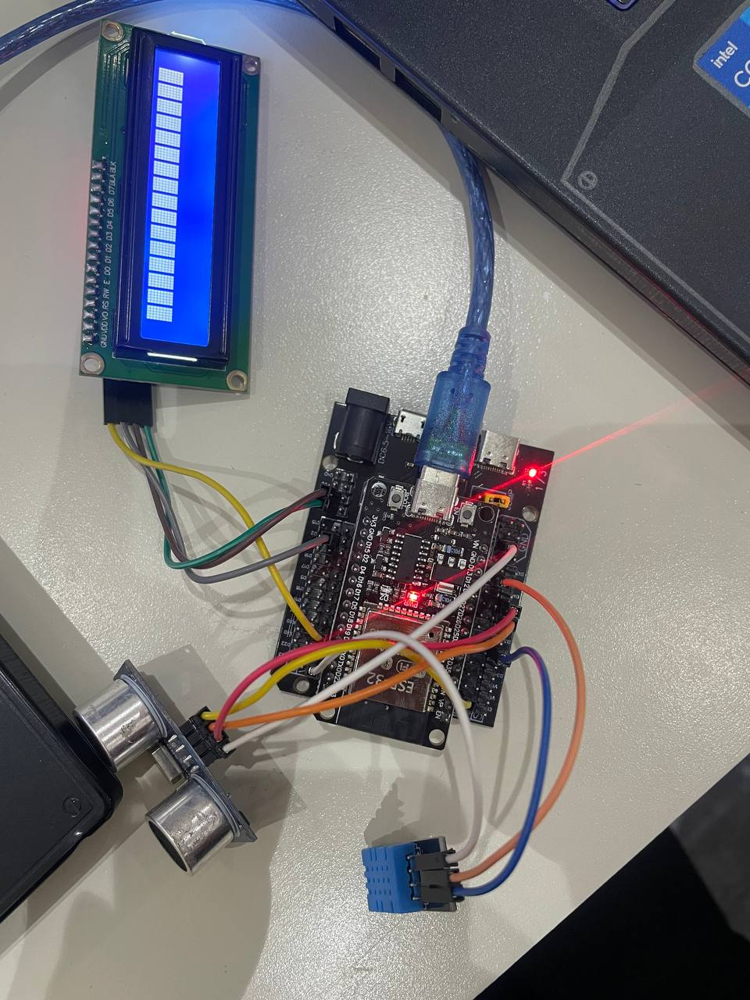
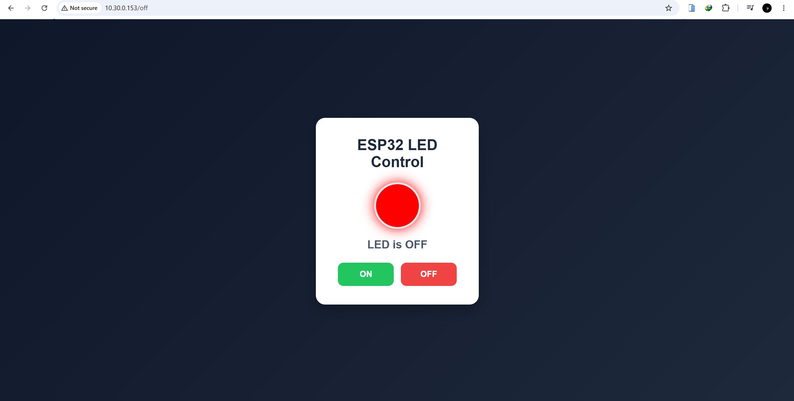
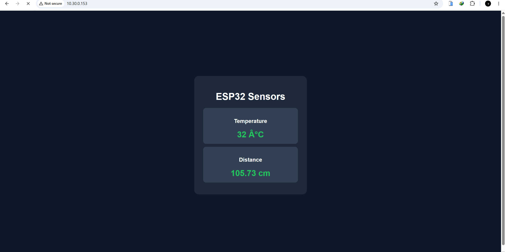
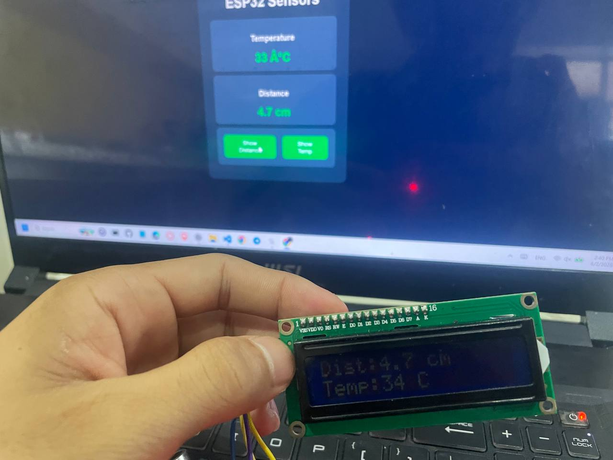
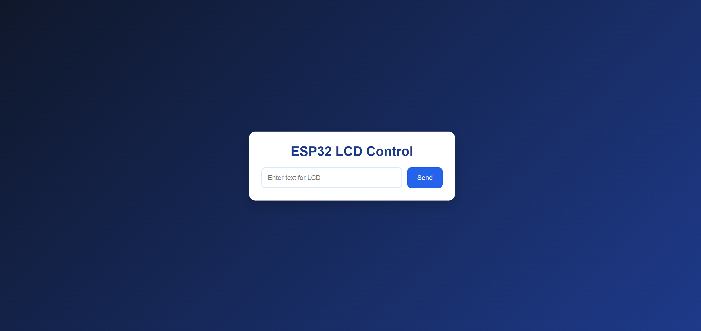
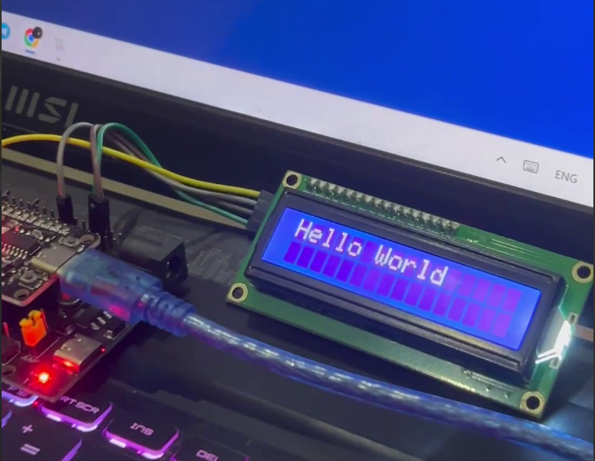

# ESP32 IoT Web Server Lab
# Project Overview

This project demonstrates an ESP32-based IoT web server that allows users to:

* Control an LED remotely through a web browser.
* Monitor temperature and distance sensor readings in real time.
* Display sensor values on an LCD screen.
* Send custom text from a web page to an LCD display.

---

# Hardware Components

| Component                   | Quantity |
| --------------------------- | -------- |
| ESP32 Development Board     | 1        |
| DHT11 Temperature Sensor    | 1        |
| Ultrasonic Sensor (HC-SR04) | 1        |
| 16x2 I2C LCD Display        | 1        |
| LED                         | 1        |
| Breadboard                  | 1        |
| Jumper Wires                | Several  |

---

# Wiring Diagram / Hardware Setup

## Wiring Diagram

> Insert wiring diagram image here.


## Actual Hardware Setup

> Insert photo of your assembled circuit here.



---

# Software Requirements

* MicroPython installed on ESP32
* Thonny IDE or VS Code
* Wi-Fi Network
* Web Browser

Required files:

```text
task1.py
task2.py
task3.py
task4.py
```

---

# Wi-Fi Configuration

Update the Wi-Fi credentials inside `main.py`:

```python
SSID = "YOUR_WIFI_NAME"
PASSWORD = "YOUR_WIFI_PASSWORD"
```

---

# Running the Project

1. Connect ESP32 to your computer.
2. Upload all project files to ESP32.
3. Open `main.py`.
4. Run the program.
5. Open Serial Monitor.
6. Note the IP address assigned to ESP32.

Example:

```text
WiFi Connected
IP Address: 192.168.1.100
```

7. Open a browser and visit:

```text
http://192.168.1.100
```

---

# Task 1 – LED Control

## Description

Two buttons (ON/OFF) are provided on the web page.

* ON button turns ON the LED connected to GPIO2.
* OFF button turns OFF the LED connected to GPIO2.

## Screenshot

Insert screenshot of web page:



## Evidence Video

Insert video link:


---

# Task 2 – Sensor Read

## Description

The web page displays:

* Temperature from DHT11
* Distance from Ultrasonic Sensor

Values refresh every 1–2 seconds.

## Screenshot

Insert screenshot:



## Sample Output

```text
Temperature: 32°C
Distance: 18 cm
```

---

# Task 3 – Sensor to LCD

## Description

Two buttons are available:

### Show Distance

Displays current distance value on LCD line 1.

### Show Temp

Displays current temperature value on LCD line 2.

## LCD Evidence

Insert LCD photo:



## Example LCD Output

```text
Dist: 18 cm
Temp: 29 C
```

---

# Task 4 – Textbox to LCD

## Description

Users can enter custom text in a textbox and press **Send**.

The message is displayed on the LCD.

Messages longer than 16 characters automatically scroll.

## Web Interface Screenshot


## Evidence Video



---

# Source Code Structure

```text
project/
│
├── task1.py
├── task2.py
├── task3.py
├── task4.py
│
├── images/
│   └── hardware_setup.jpg
│
├── images/
│   ├── task1.png
│   ├── task2.png
│   ├── task3.jpg
│   ├── task4.png
│   └── task4_output.jpg
│
├── videos/
│   ├── task1-led-control.mp4
│   └── task4-custom-text.mp4
│
└── Lab2_README.md
```

# Challenges Encountered

Describe any issues encountered during development and how they were resolved.

Example:

* LCD address configuration issue.
* Wi-Fi connection timeout.
* Sensor reading delays.

---

# Conclusion

This lab successfully demonstrated the integration of an ESP32 web server with sensors, LCD display, and browser-based controls. The project shows how IoT devices can be monitored and controlled remotely through a web interface.
