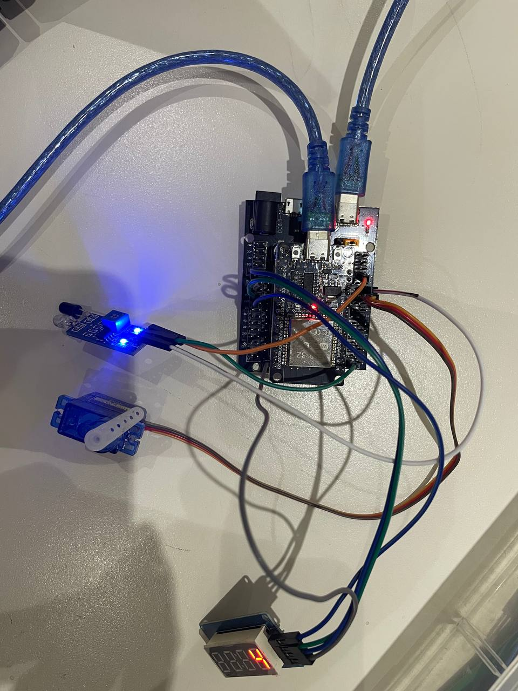
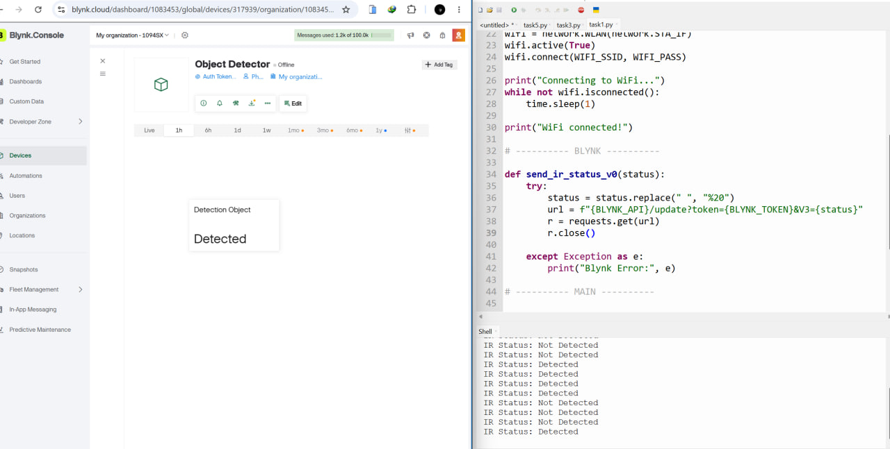
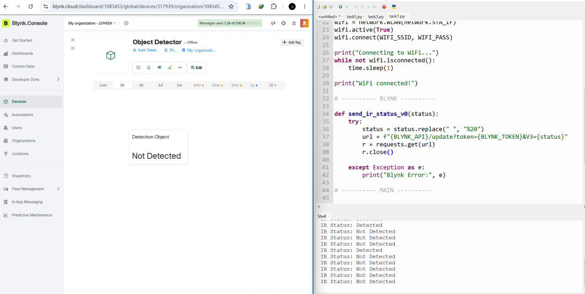

# ESP32 + Blynk Automation Lab
# Project Overview

This project demonstrates the integration of an ESP32 with Blynk to perform real-time monitoring and control using various hardware components.

The system supports:

* IR sensor status monitoring through Blynk
* Servo motor control using a Blynk slider
* Automatic servo response to IR object detection
* Detection event counting using TM1637 display
* Manual override mode through Blynk

---

# Hardware Components

| Component               | Quantity |
| ----------------------- | -------- |
| ESP32 Development Board | 1        |
| IR Sensor Module        | 1        |
| Servo Motor (SG90)      | 1        |
| TM1637 4-Digit Display  | 1        |
| Jumper Wires            | Several  |
| Breadboard              | 1        |

---

# Hardware Setup+
## Actual Hardware Setup

> Insert a clear photo of your circuit.



---

# Blynk Dashboard Configuration

> Insert screenshot of Blynk dashboard below.


---

# Software Requirements

* MicroPython installed on ESP32
* Blynk Library
* Thonny IDE or VS Code
* Blynk Mobile Application

---

# Blynk Configuration

Update the following credentials inside `main.py`:

```python
BLYNK_AUTH = "YOUR_BLYNK_TOKEN"

WIFI_SSID = "YOUR_WIFI_NAME"
WIFI_PASSWORD = "YOUR_WIFI_PASSWORD"
```

---

# Running the Project

1. Connect ESP32 to your computer.
2. Upload `main.py` to ESP32.
3. Verify the Blynk dashboard widgets are configured correctly.
4. Run `main.py`.
5. Ensure the ESP32 connects to Wi-Fi and Blynk successfully.
6. Open the Blynk application to interact with the system.

---

# Task 1 – IR Sensor Reading

## Objective

Read the IR sensor digital output using ESP32 and display the sensor status on Blynk.

### Expected Behavior

* Object detected → Blynk displays **Detected**
* No object detected → Blynk displays **Not Detected**

---

## Evidence

### Blynk Screenshot




---

# Task 2 – Servo Motor Control via Blynk

## Objective

Use a Blynk Slider widget to control the servo motor position.

### Expected Behavior

* Slider range: **0° – 180°**
* Servo follows the slider position in real time.

---

## Evidence

### Demonstration Video

[Watch Video](videos/task2.mp4)

---

# Task 3 – Automatic IR–Servo Action

## Objective

Automatically operate the servo when the IR sensor detects an object.

### Expected Behavior

1. IR sensor detects an object.
2. Servo rotates to the open position.
3. After a short delay, servo returns to the closed position.

---

## Evidence

### Demonstration Video

[Watch Video](videos/task3.mp4)

---

# Task 4 – TM1637 Display Integration

## Objective

Count the number of IR detection events.

### Expected Behavior

* Every IR detection increments the counter.
* TM1637 displays the current count.
* Blynk Numeric Display shows the same value.

---

## Evidence

### Demonstration Video

[Watch Video](videos/task4.mp4)

# Task 5 – Manual Override Mode

## Objective

Implement a manual override mode using a Blynk switch.

### Expected Behavior

### Automatic Mode Enabled

* IR sensor controls the servo automatically.

### Manual Mode Enabled

* IR sensor input is ignored.
* Servo only responds to Blynk slider commands.

---

## Evidence

### Demonstration Video

[Watch Video](videos/task5.mp4)

---

# GitHub Repository

Repository Link:

```text
https://github.com/yourusername/your-repository
```

---

# Demonstration Video

A 60–90 second video demonstrating:

* IR sensor status updates on Blynk
* Servo control using Blynk slider
* Automatic IR-triggered servo action
* TM1637 counter synchronized with Blynk
* Manual override functionality

Video Link:

```text
videos/final-demo.mp4
```

---

# Challenges Encountered

Describe any difficulties experienced during development and how they were solved.

Examples:

* Blynk connection issues
* Servo jittering
* Multiple IR detections from a single object
* TM1637 synchronization problems

---

# Conclusion

This lab successfully demonstrated the use of Blynk for remote monitoring and control of ESP32 peripherals. The integration of sensors, actuators, displays, and mobile interfaces illustrates practical applications of IoT systems in automation and smart environments.
